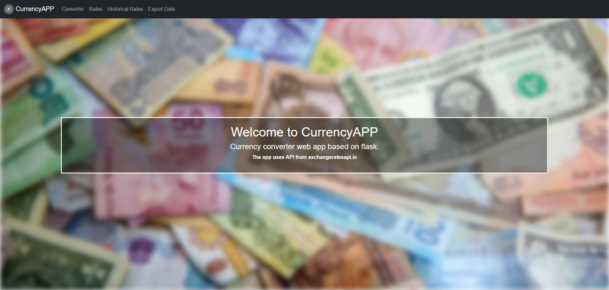

# CurrencyAPP

CurrencyAPP is a web based application to convert currency rates. You can convert currency with latest rates or historical rates. You can learn all latest rates from your currency. You can learn currency rates in time interval. Also, you can export data as a .csv file.



## Installation

Installation requires Python3 and Virtualenv.

```bash
~$ git clone https://github.com/aesavas/CurrencyAPP.git && cd CurrencyAPP
~$ python -m virtualenv venv
~$ source venv/Scripts/activate
~$ pip install -r requirements.txt
~$ env FLASK_APP=server.py
~$ env FLASK_ENV=1
~$ flask run
```

Please visit the address with a web browser.

> CurrencyAPP URL (/localhost:5000): http://127.0.0.1:5000/